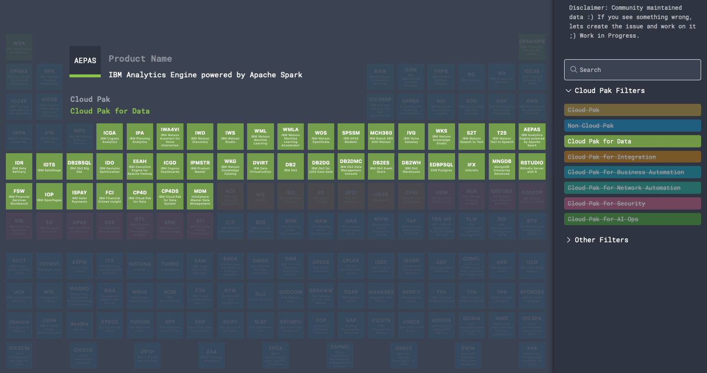

# IBM Software Map

Repository with the IBM software displayed in a periodic table for easier visualisation of many of the products offered by IBM.

## Contributing Content
I am more than happy if someone can help in advancing this project :hugs:. I've split this section on visuals and product data, but also here are guidelines into working with the repository:

- If you find something not right or missing or exciting that could be added, please create a descriptibe Issue :wink:
- Master branch is protected
- To contribute follow the following steps OR edit directly through the Web Interface of GitHub.
  - create your own branch
  - create a pull request from the branch
  - commit your work frequently
  - when done, ask for approval of the pull request
  - reviewers will do so and it will be merged
- If you want to test how the changes look, you can do so locally via `yarn install` and then `yarn dev`

### Product Data
All product data are located in: `./assets/data/areas`
All the product descriptions have to adhere to the schema in `./assets/data/schema/schema.json`
### Visuals
All is based on VueJS framework, but it is actually quite simple, be sure to test locally before commiting your changes to the repository.

## Thanks To
This repository is based on the work of open-source community that built periodic table in vue.js, the following repositories where used to create this one:

- https://github.com/pulsardev/mendelable
- https://github.com/edisdev/periodic-table
